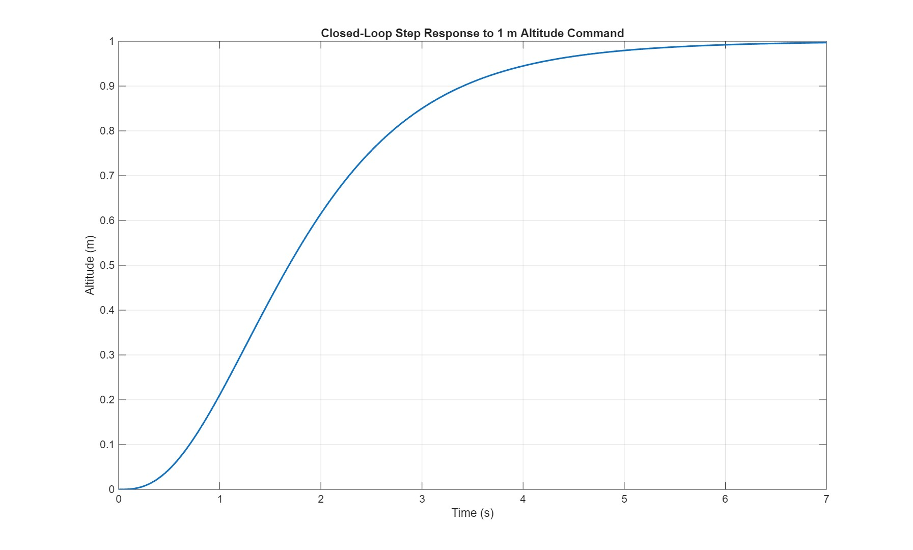

# Crazyflie Flight Control

Modeling, controller design, actuator allocation, simulation, and hardware validation for a **Crazyflie 2 quadrotor**.

The project builds a 12-state nonlinear model, linearizes around hover, designs LQR/LQR-PI controllers for the primary flight channels, maps desired wrench commands to feasible motor PWM commands, and studies the gap between simulation and real flight.

## System pipeline


## Repository structure

```text
.
├── matlab/
│   ├── modeling/
│   │   ├── crazyflie_dynamics_linearization.m
│   │   └── crazyflie_dynamics_aerodynamics.m
│   ├── control/
│   │   ├── altitude_lqr_pi.m
│   │   ├── forward_position_lqr_pi.m
│   │   ├── lateral_position_lqr_pi.m
│   │   └── yaw_rate_lqr.m
│   ├── allocation/
│   │   ├── actuator_mixer_analysis.m
│   │   └── wrench_to_pwm.m
│   └── guidance/
│       └── rounded_square_path_following.m
├── simulink/
│   └── control_architecture.slx
├── results/
│   ├── aerodynamics/
│   ├── altitude/
│   ├── forward/
│   ├── lateral/
│   ├── allocation/
│   ├── yaw/
│   └── guidance/
├── docs/
│   └── block-diagrams/
└── setup_paths.m
```

The repository intentionally excludes unrelated state-estimation coursework and generated MATLAB workspace files so the public project stays focused on the Crazyflie control stack.

## Quick start

In MATLAB, run:

```matlab
setup_paths
```

Then execute any analysis script, for example:

```matlab
run("matlab/control/altitude_lqr_pi.m")
run("matlab/allocation/actuator_mixer_analysis.m")
run("matlab/modeling/crazyflie_dynamics_linearization.m")
```

## Modeling

The main model uses 12 states:

```text
position:       X, Y, Z
velocity:       Xdot, Ydot, Zdot
attitude:       roll, pitch, yaw
angular rates:  p, q, r
```

`crazyflie_dynamics_linearization.m` derives the nonlinear equations symbolically, computes the hover trim point, linearizes the system, checks controllability, and augments the plant with motor actuator dynamics.

`crazyflie_dynamics_aerodynamics.m` extends the model with a PWM-to-RPM fit and an aerodynamic force model.

## Control

Four channel-level studies are organized under `matlab/control/`:

- **Altitude:** LQR-PI on altitude, vertical velocity, and integral error.
- **Forward position:** LQR-PI coupled through pitch.
- **Lateral position:** LQR-PI coupled through roll.
- **Yaw rate:** LQR stabilization of body yaw rate.

The design process compares LQR input penalties using time-domain response plus gain/phase margins, while also checking whether the resulting motor commands are physically achievable.

### Representative altitude response



### Altitude loop analysis


## Actuator allocation

The controller outputs a desired wrench

```text
[T, L, M, N]
```

for total thrust and roll/pitch/yaw moments.

`wrench_to_pwm.m` converts this wrench into four motor thrusts and PWM ratios. If the desired wrench is infeasible, the allocation logic:

1. preserves total thrust within the achievable envelope;
2. scales the three body moments by a common factor;
3. converts motor thrust to PWM using the fitted quadratic thrust model;
4. clips the final PWM values to the valid actuator range.

This keeps vertical thrust prioritized while preserving the direction of the requested moment vector as much as possible.

## Simulation and hardware validation

Simulation demonstrated stable hover behavior at a 0.5 m altitude target. Real-flight validation exposed a clear simulation-to-hardware gap: the first custom-controller flight was too aggressive and flipped immediately after takeoff. Flight logs were then used to retune LQR penalties, verify Crazyflie pitch/sign conventions, and delay integral accumulation until the vehicle had lifted off.

After those changes the system produced more reasonable behavior and partial lift-off, but it did **not** achieve a stable 0.5 m hardware hover before the project ended. This repo keeps that distinction explicit rather than presenting simulation performance as hardware performance.

## Results

The `results/` directory contains the main controller response, Bode/Nyquist, PWM, motor-thrust, aerodynamic-fit, and guidance figures used during the project.

## Tools

MATLAB · Simulink · Control System Toolbox · Symbolic Math Toolbox · Optimization Toolbox

## Project context

Developed as a control-systems project at Washington University in St. Louis. The public repository is organized around the technical system rather than course assignment numbering.
