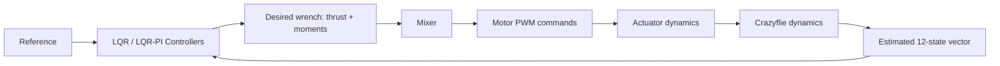
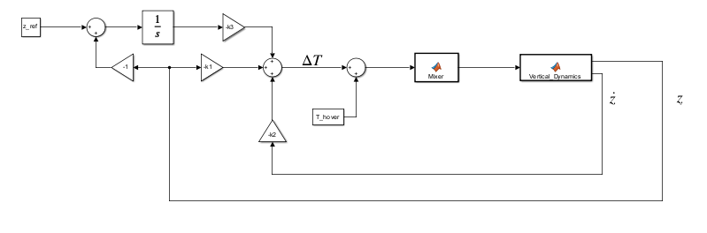

# Crazyflie Flight Control

Modeling, controller design, simulation, and hardware validation for a **Crazyflie 2 quadrotor**.

The project develops a 12-state drone model, designs LQR/LQR-PI controllers for the main flight channels, converts desired wrench commands into motor PWM values through a mixer, and evaluates the closed-loop system in both time and frequency domains.

## Project goals

The original control objective was to make the Crazyflie:

1. take off,
2. hover at a commanded altitude,
3. maintain stable attitude / yaw behavior,
4. translate in the horizontal plane,
5. eventually support higher-level path following.

The completed work includes detailed modeling and simulation plus early hardware validation.

## Control pipeline



## Main components

### Dynamics

`dynamics.m` models the quadrotor state evolution using position, velocity, Euler angles, and body angular rates.

An additional `dynamics_include_aero.m` variant includes aerodynamic terms used in extended simulation studies.

### LQR / LQR-PI control

Separate controller studies are included for:

- altitude,
- forward position / pitch,
- lateral position / roll,
- yaw rate.

Each design studies the relationship between state weighting, control effort, step response, and stability margins.

### Mixer

`mixer.m` and `mixer_pwm_command.m` map desired total thrust and body moments to individual motor commands.

### State estimation

`state_estimation.m` and `kalman_filtering.m` contain estimation experiments used to study noisy position / velocity measurements.

### Path-following experiments

`path_following.m` contains a higher-level path-following simulation used as an additional guidance/control experiment.

## Representative results

### Altitude controller


The hover simulation targets an altitude of **0.5 m** and converges to the reference in the simulated model.

### Controller architecture



Equivalent block-diagram studies are included for forward, lateral, and yaw channels.

### Frequency-domain analysis

Bode and Nyquist figures are included for the main control loops to evaluate gain/phase margin and robustness with actuator dynamics.

## Simulation vs. hardware

The simulation results were substantially stronger than the first real-flight tests.

During hardware validation, the initial controller was too aggressive and produced an immediate flip after takeoff. Flight logs were then used to investigate several issues:

- controller gain / control-effort penalties;
- Crazyflie body-frame and sign conventions;
- integral-error accumulation before takeoff;
- hardware condition after repeated crashes.

After these changes and further tuning, the drone achieved more reasonable behavior and partial lift-off, but the project did **not** reach a stable 0.5 m hardware hover before the end of the project.

That simulation-to-reality gap is intentionally documented rather than hidden; it was one of the most useful engineering outcomes of the project.

## Repository layout

```text
.
├── dynamics.m
├── dynamics_include_aero.m
├── altitude_control.m
├── forward_position_control.m
├── lateral_position_control.m
├── yaw_rate_control.m
├── mixer.m
├── mixer_pwm_command.m
├── state_estimation.m
├── kalman_filtering.m
├── path_following.m
├── midterm_block_diagram.slx
│
├── Aero_Figures/
├── Altitude_Figures/
├── Forward_Figures/
├── Lateral_Figures/
├── Yaw_Figures/
├── Mixer_Figures/
├── State_Estimation_Figures/
├── Path_Following_Figures/
└── Block_Diagrams/
```

## Tools

- MATLAB
- Simulink
- Control System Toolbox-style analysis
- LQR / LQR-PI control
- Kalman-filtering experiments

## Status

This repository currently contains the main component simulations and analysis code. A larger course archive also contains generated files and additional intermediate artifacts; those are intentionally not committed here.

The repository is being kept focused on source code, controller design, and representative results rather than raw MATLAB/Simulink build outputs.
